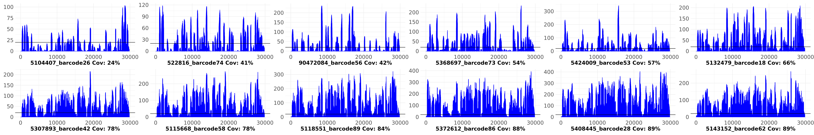

# wf-artic-utilities

This repository contain necessary code to make custom coverage plots (`customCoveragePlots.nf`) and generate new assembly using ONT results (`reviseAssembly.nf`) generated by `wf-artic` pipeline. 

## Setting Up
```bash
## If you don't have mamba, download it using

conda install -c conda-forge mamba -n base

## Install dependencies now to run the scripts in this directory
mamba create -n wf-artic-utilities -c conda-forge -c bioconda -c epi2melabs -c nanoporetech fastcat
bcftools \
biopython \
covtobed  \
fonttools \
ghostscript \
matplotlib \
mosdepth  \
nextflow  \
pybedtools \
r-gplots \
r-gsalib \
scikit-learn \
seaborn \
vafator  \
seqtk \
seqkit \
fastcat \
r-biocmanager \
r-dplyr \
r-stringr \
r-pacman \
r-tidyr \
r-plotly \
r-argparse \
r-ggsci \
r-htmlwidgets \
r-egg \
r-data.table \
bioconductor-biocgenerics \
bioconductor-biostrings \
bioconductor-s4vectors \
r-patchwork

## Activate the environment
conda activate wf-artic-utilities
```

## customCoveragePlots.nf

The examplary coverage plots are present in `examples` directory and helps user intuitively tag samples as "Good (> 90% Coverage)", "mediocre (between 80-90% coverage)" and "bad (less than 80% coverage)" based on coverage alone. 

> Note: This is old criteria for GISAID sequence submission and presently genomes with atleast 50% of genome covered and untruncated Spike protein untruncated are now considered for genome submission.

The Coverage plot is inspired from `Location of Ns in Final Consensus` section of the `wf-artic` html report. The region-plot shown below (left) demarcates regions with low depth-of-coverage (less than 20X and therefore hard masked) and the bar plot on the right represent how deeply that sample was sequenced.


```bash
## Running the wf-artic workflow to produce results first

nextflow run main.nf --fastq /data/covid_sept2023/fastq_pass --out_dir wf-articresults --scheme_version \
ARTIC/V4.1 --medaka_variant_model r941_min_fast_variant_g507 \
--pangolin_version latest --update_data true  -profile singularity --min_len 100 --update_data false -resume

```
Now running our `customCoveragePlots.nf` script
```
## To view parameters to be passted to ctomCoveragePlots.nf

nextflow run customCoveragePlots.nf --help

## Running customCoveragePlots.nf

nextflow run customCoveragePlots.nf --bams "$PWD/KFSHRC_3rd_Batch_fastq_files/wf-articresults/*bam" --fqpassDir "$PWD/KFSHRC_3rd_Batch_fastq_files/fastq_pass/" --fasta "$PWD/KFSHRC_3rd_Batch_fastq_files/wf-articresults/*.fasta" 

```

It also calculates coverage internally, and filters sample table and produce coverage plots for samples tagged as "mediocre" or "bad" in terms of coverage, as shown below



## reviseAssembly.nf

This script enables users to filter low quality variants, if any, from the VCF file and use the filtered VCF file to generate new consensus assembly. Any variant with Variant Allele Fraction (VAF) lower than 0.5, DP < 100 and ADP < 50 is tagged as `POOR_CALLS` and is filtered using [VAFATOR](https://github.com/tron-bioinformatics/vafator). We also provide `skipHomopolymerMasking` option that enables you to skip filtering variants present in homopolymer regions (Default: Such filtering is discouraged as of now but has been made available due to best practices mentioned in [connor et al 2022](https://pubmed.ncbi.nlm.nih.gov/36380755/). Besides it was observed to influence Clade assignment as being discussed [here](https://github.com/ncbi/ACTIVTRACEvariants/issues/3)).

~This script is completely experimental and the tool `VAFATOR` seems to miss `28881–28883: GGG > AAC` causing reversion-mutation in assemblies which are heavily penalised by `nextclade` while assigning QC Score.~

`Update: 29-Nov-2022`

> The issue of missing MNV has been resolved by their atomization before calculating VAF.


The output of this script is indexed, softfiltered VCF file with revised assembly.

```bash
nextflow run reviseAssembly.nf --help

nextflow run reviseAssembly.nf --vcf "KFSHRC_ALL_ONT_SAMPLES/KFSHRC_3rd_Batch_fastq_files/wf-articresults/*.pass.named.vcf.gz" --bam "KFSHRC_ALL_ONT_SAMPLES/KFSHRC_3rd_Batch_fastq_files/wf-articresults/*.primertrimmed.rg.sorted.bam"
```

## reviseGisaid.nf

This script enables users to revise assemblies after manually filtering the vcfs. Sometime, some variants are send for review by GISAID that require validation. If you choose to remove those variants after reviewing their status as poor variant calls use this script. 


```
nextflow run reviseGisaid.nf --vcf "../GISAID_revision.v.2/*.vaf.annot.vcf.gz" --bam "../GISAID_revision.v.2/*.primertrimmed.rg.sorted.bam" --output ../GISAID_revision.v.2/GISAID_revised_fasta
```
### To Do's

- Phasing variants is pending. 

## R code to sanitize headers of assemblies

```R
library(seqinr)
f <- read.fasta("raw.v.1/all_138.fasta", whole.header = T,forceDNAtolower = F)
t <- read.csv("Dana_139_samples_metadata.v4.csv")
t$GISAID.UID <- paste0("hCoV-19/Saudi/KAUST",432:(432+nrow(t)-1),"/",t$Year)
t$map <- ifelse(t$Folder== "Dana_Data_1", paste(t$Seq.Name,"MN908947.3"), paste(t$Barcode,"MN908947.3"))
df <- t[match(names(f), t$map),]
names(f) <- df$GISAID.UID
is.na(names(f))
write.fasta(f,names(f),file.out = "all_138_revised.fasta")

```
