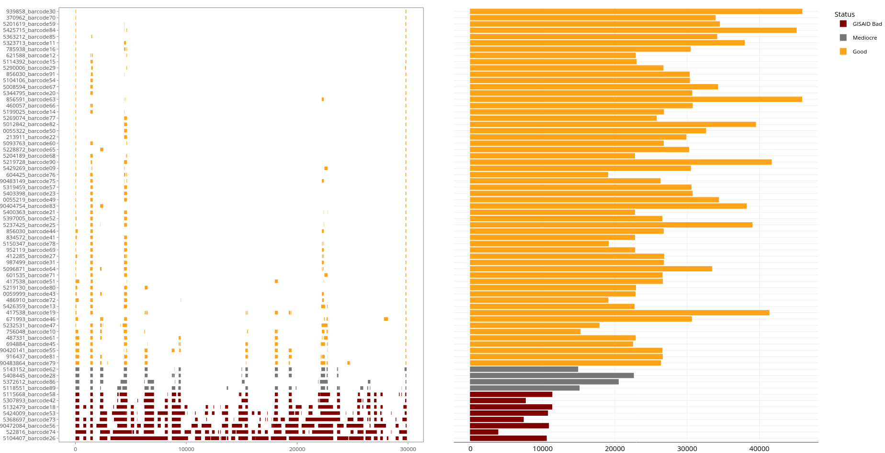

# wf-artic-utilities

This repository contain necessary code to make custom coverage plots (`customCoveragePlots.nf`) and generate new assembly using ONT results (`reviseAssembly.nf`) generated by `wf-artic` pipeline. 

## Setting Up
```
## If you don't have mamba, download it using

conda install -c conda-forge mamba -n base

## Install dependencies now to run the scripts in this directory
mamba create -n wf-artic-utilities -c conda-forge -c bioconda -c epi2melabs \
bcftools \
biopython \
covtobed  \
fonttools \
ghostscript \
matplotlib \
mosdepth  \
nextflow  \
pybedtools \
r-gplots \
r-gsalib \
scikit-learn \
seaborn \
vafator  \
seqtk \
seqkit \
fastcat \
r-biocmanager \
r-dplyr \
r-stringr \
r-pacman \
r-tidyr \
r-plotly \
r-argparse \
r-ggsci \
r-htmlwidgets \
r-egg \
r-data.table \
bioconductor-biocgenerics \
bioconductor-biostrings \
bioconductor-s4vectors \
r-patchwork

## Activate the environment
conda activate wf-artic-utilities
```

## customCoveragePlots.nf

The examplary coverage plots are present in `examples` directory and helps user intuitively tag samples as "Good (> 90% Coverage)", "mediocre (between 80-90% coverage)" and "bad (less than 80% coverage)" based on coverage alone. This is old criteria for GISAID sequence submission and presently genomes with atleast 50% of genome covered and untruncated Spike protein untruncated are considered for genome submission.

The Coverage plot is inspired from `Location of Ns in Final Consensus` section of the `wf-artic` html report. The region-plot shown below (left) demarcates regions with low depth-of-coverage (less than 20X and therefore hard masked) and the bar plot on the right represent how deeply that sample was sequenced.



```
## Running the wf-artic workflow to produce results first

nextflow run epi2me-labs/wf-artic --fastq /home/subudhak/Documents/COVID_Project/KFSHRC_ALL_ONT_SAMPLES/KFSHRC_BATCH2_Plate2_samples/fastq_pass/ --out_dir /home/subudhak/Documents/COVID_Project/KFSHRC_ALL_ONT_SAMPLES/KFSHRC_BATCH2_Plate2_samples/wf-articresults --scheme_version ARTIC/V4.1 --medaka_model r941_min_fast_variant_g507 --pangolin_version 4.1.2 --update_data true --report_detailed true -profile singularity

```
Now running our script
```
## To view parameters to be passted to ctomCoveragePlots.nf

nextflow run customCoveragePlots.nf --help

## Running customCoveragePlots.nf

nextflow run customCoveragePlots.nf --bams "$PWD/KFSHRC_BATCH2_Plate2_samples/wf-articresults/*bam" --fqpassDir "$PWD/KFSHRC_BATCH2_Plate2_samples/fastq_pass/" --fasta "$PWD/KFSHRC_BATCH2_Plate2_samples/wf-articresults/*.fasta" 

```
